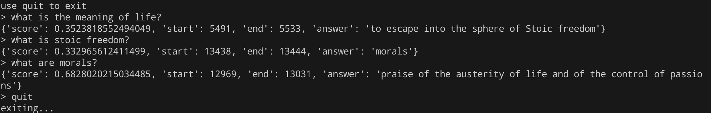

# Talos

A simple POC question/answering bot based on [chromadb](https://www.trychroma.com/), [transformers](https://huggingface.co/docs/transformers/index), and the [distilbert-base-cased-distilled-squad](https://huggingface.co/distilbert-base-cased-distilled-squad) checkpoint.

Talos was a mythological [bronze automaton](https://en.wikipedia.org/wiki/Talos) that protected Europa (the princess) in Crete against pirates and invaders.

## How to use
0) create a venv: `python3 -m venv ./my-venv/`
1) activate the venv: `. ./my-venv/bin/activate`
2) install packages: `pip3 -r requirements.txt`
3) Download e.g. the [Enchiridion](https://www.gutenberg.org/ebooks/45109) as txt or any other books into `./books/`
4) Run `./src/load_books.py`
5) Run `./src/main.py` and ask away

## Example

Using the Enchiridion from Epictetus (an ancient stoic) as the source for context, I ran the script and got the following:

Given that the text is a translation from ancient greek in not very modern greek it could be worse, but can be improved.

## TODO

- Improve answers with a better model (fine tune one?)
- Improve performance
